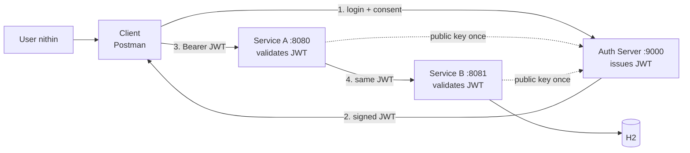
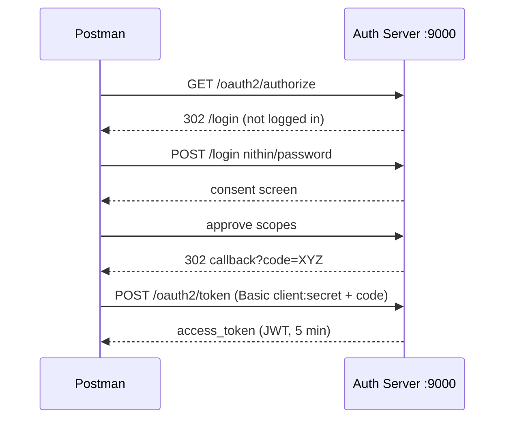

# Securing Payment Microservices with OAuth2 + JWT

Sep 23, 2026 · Nithin

We secured the payment system end to end: a new Spring Authorization Server on :9000 issues signed 5-minute JWTs, and Services A (:8080) and B (:8081) validate them and check scopes. The full flow ran successfully on your computer: login, code, token, and a payment through A to B.

## Architecture

Three Spring Boot apps: one issues tokens, two validate them. Service A forwards the caller's same JWT to Service B, so both protect themselves.

A and B fetch the public key once from `/oauth2/jwks`, cache it, and never call the Auth Server per request.

| App | Port | Role | Key dependency (Boot 3.5.5) |
| --- | --- | --- | --- |
| payment-authorization-server | 9000 | Authorization Server: logs in users, issues and signs JWTs | spring-boot-starter-oauth2-authorization-server |
| Service A (gateway) | 8080 | Resource Server: validates JWT, calls B via WebClient | spring-boot-starter-oauth2-resource-server |
| Service B (persistence) | 8081 | Resource Server: validates JWT, saves payments | spring-boot-starter-oauth2-resource-server |

### The Authorization Code flow

The user types the password only on the Auth Server's own login page; the client never sees it.

## Design decisions (Q1–Q20)

We answered 20 design questions before writing any code, so every line of config maps to a decision.

| # | Question | Decision |
| --- | --- | --- |
| Q1 | Who issues the JWT? | Spring Authorization Server on :9000 |
| Q2 | Who receives it? | The client (Postman) |
| Q3 | Who validates it? | Service A and Service B |
| Q4 | What's inside? | `sub`, `iss`, `aud`, `scope`, `iat`, `exp` |
| Q5 | How do we know it's genuine? | Digital signature: private key signs, public key verifies |
| Q6 | Where do A/B get the public key? | From the Auth Server, discovered via issuer URL `http://localhost:9000` |
| Q7 | No JWT? | 401 |
| Q8 | Invalid JWT? | 401, and the request never reaches the controller |
| Q9 | Do both A and B validate? | Yes, each protects itself (defense in depth) |
| Q10 | Does A forward the JWT to B? | Yes, the same token |
| Q11 | Who asks for the token? | A user, through a client application |
| Q12 | Where does the user type the password? | On the Auth Server's own login page (Authorization Code flow; password grant is deprecated) |
| Q13 | Where do users come from? | In memory: `nithin / password` |
| Q14 | What does the Auth Server check? | Two identities: the person and the application |
| Q15 | Which scopes? | `payment.read` (GET), `payment.write` (POST); least privilege |
| Q16 | Token lifetime? | 5 minutes; refresh tokens later |
| Q17 | Which endpoints are open? | `/actuator/health`; `/h2-console` local only; everything else needs a JWT (deny by default) |
| Q18 | B rejects the token? | A passes on 401/403 with a clean message, no internal details |
| Q19 | Where does A get the token for B? | The incoming request's token, read from the SecurityContext |
| Q20 | Auth Server restarts? | New key in memory, so old tokens are rejected (401); key rotation later |

**401 vs 403:** 401 = "I don't know who you are" (no token, bad token, expired). 403 = "I know you, but you're not allowed" (valid token, missing scope).

**Authentication comes first.** The "Authorization Server" authenticates the user and the client, then authorizes the client by issuing a token with approved scopes. OAuth 2.0 is an authorization framework, which is where the name comes from.

### Q16 detail: token lifetime

Short token (5 min) limits damage if stolen. Your idea of a 1-hour login session is real: after login, the Auth Server keeps a session cookie, so getting a new token doesn't need the password again. For APIs, the standard answer is a **refresh token**: short access token (sent everywhere) + long refresh token (sent only to the Auth Server).

### Q20 detail: the keys belong to the Auth Server

Nithin has no keys, only a username and password. The Auth Server has one private key (stamps every JWT) and publishes the public key. Restart = new key = every old token fails with 401.

## Services A and B (resource servers)

| Setting | Service A :8080 | Service B :8081 | Why |
| --- | --- | --- | --- |
| Dependency | oauth2-resource-server | oauth2-resource-server | Validate, never issue |
| `issuer-uri` | `http://localhost:9000` | `http://localhost:9000` | Discover + cache the public key (Q6) |
| `POST /payments/**` | `SCOPE_payment.write` | `SCOPE_payment.write` | Q15 |
| `GET /payments/**` | `SCOPE_payment.read` | `SCOPE_payment.read` | Q15 |
| Sessions | STATELESS | STATELESS | Every request proves itself |
| CSRF | Off | Off | Bearer tokens, no cookies |
| Open paths | none listed yet | `/h2-console/**` + frame options sameOrigin | Q17 |
| Token relay to B | WebClient filter forwards incoming JWT | n/a | Q10, Q19 |

- **`SCOPE_` prefix:** Spring turns the JWT scope `payment.write` into the authority `SCOPE_payment.write`. Forgetting it means "always 403".
- **`localhost` everywhere:** `127.0.0.1` counts as a different issuer, and every token gets rejected.
- **Token relay filter:** A uses `ServerBearerExchangeFilterFunction` (reactive version). The servlet version is `ServletBearerExchangeFilterFunction`. Relay worked in tests, so the current setup forwards the token; worth confirming which style A uses.

## Test results (live runs, 23 Sep)

The full flow passed twice: login page, code, token exchange (200 OK, tests 2/2), and payment calls through A to B. See `07-test-session-log.md`.

### Decoded token (run 1)

| Claim | Value | Came from |
| --- | --- | --- |
| header `kid` | `f445aa14-e9eb-4ae2-9673-2595ae0731d1` | ⑤ jwkSource; matches `/oauth2/jwks` |
| header `alg` | RS256 | RSA signature |
| `sub` | nithin | ③ the person |
| `aud` | payment-client | ④ the application |
| `scope` | payment.write, payment.read | Consent screen |
| `iss` | http://localhost:9000 | ⑦ issuer |
| `exp − iat` | 300 s | 5-minute TTL |

## Open gaps and next steps

### Tests still to run

- [ ] No token on A and B → 401
- [ ] Token with one character changed → 401
- [ ] Read-only token (`payment.read` only) on `POST` → 403
- [ ] Wait 6 minutes, reuse token → 401
- [ ] Restart the Auth Server, reuse token → 401
- [ ] Malformed body with valid token → 400, not 401
- [ ] Change B's POST rule to `payment.admin`, call A → A returns 403, not 500
- [ ] `/actuator/health` without token → 200 (or 404 if Actuator isn't installed)

### Known gaps

- [ ] **Error passthrough (Q18):** add handlers in A for B's 401/403 with clean messages
- [ ] **Open endpoints (Q17):** permit `/error` and `/actuator/health` in A and B
- [ ] **Relay filter style:** confirm A is servlet or reactive and use the matching bearer filter

### Later (production topics)

- Database-backed users and clients; BCrypt-encoded secrets
- Persistent signing keys and key rotation
- Refresh tokens and revocation
- Audience (`aud`) restriction per service
- Client credentials for machine-to-machine calls (see `11-client-credentials-and-settlement.md`)
- Method security with `@PreAuthorize`
- `createdBy` on payments from the token's `sub`

## Our way of working

Claude writes user stories, "shall" requirements, UML and acceptance criteria; you implement; Claude reviews the code like a PR.

## Sources

- [Spring Security: Authorization Server Getting Started](https://docs.spring.io/spring-security/reference/servlet/oauth2/authorization-server/getting-started.html)
- [Spring Authorization Server 1.5 reference](https://docs.spring.io/spring-authorization-server/reference/getting-started.html)
- [Spring Boot 4.0 Migration Guide (starter renames)](https://github.com/spring-projects/spring-boot/wiki/Spring-Boot-4.0-Migration-Guide)
